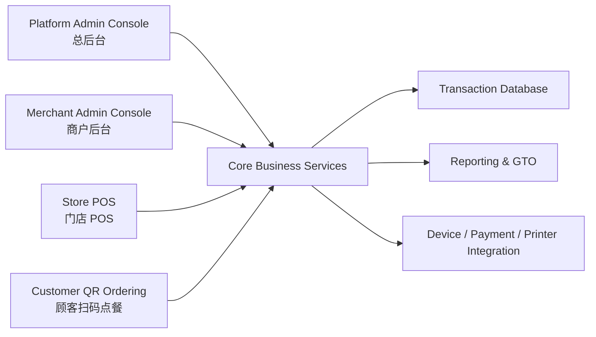
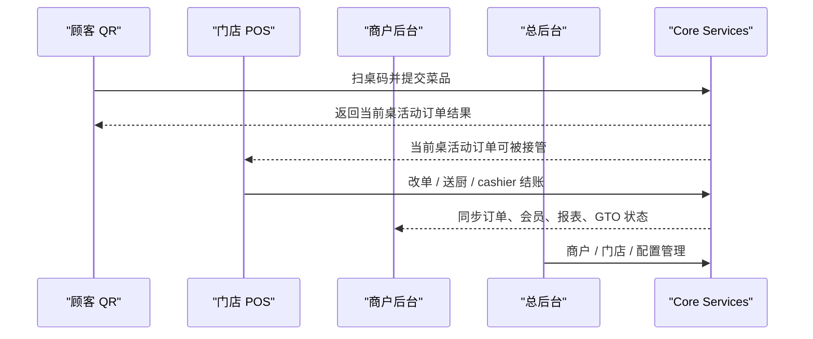

# System Landscape

## 1. Goal

本文档用于定义 Restaurant POS 的四端系统全景，明确：

- 总后台、商户后台、门店 POS、顾客 QR 四端分别服务谁
- 每一端负责什么
- 它们之间共享哪些核心业务域
- 数据如何在四端之间流动

这份文档的目标不是替代详细架构设计，而是提供一个统一、稳定的系统认知框架。

## 2. Four-End Product Structure

Restaurant POS 最终不是一个单端 POS，而是一个四端系统：

1. 总后台
2. 商户后台
3. 门店 POS
4. 顾客 QR 扫码点餐

## 3. System Landscape Diagram

## 4. Audience and Responsibility by End

### 4.1 Platform Admin Console

服务对象：

- 平台管理员
- 平台运营
- 平台财务
- 平台实施 / 技术支持

职责：

- 商户开通与停用
- 门店开通与配置模板下发
- 平台级账号与权限
- 设备与终端管理
- 支付 / 打印 / GTO 配置下发
- 平台级订单监管与异常排查
- 平台级运营与支持视图

不负责：

- 门店现场点单
- 门店 cashier 收款
- 顾客交互

### 4.2 Merchant Admin Console

服务对象：

- 老板
- 财务
- 店长
- IT

职责：

- 经营数据查看
- 订单、退款、报表管理
- CRM 会员管理
- 促销规则管理
- SKU / Catalog 管理
- 门店员工与角色管理
- GTO 批量同步查看与重试
- 门店配置管理

不负责：

- 顾客扫码交互
- 前台实际收款操作

### 4.3 Store POS

服务对象：

- cashier
- 服务员
- 店内前台人员

职责：

- 桌台管理
- POS 点单
- 接住 QR 桌单
- 当前桌活动订单编辑
- 送厨 / 待结账 / 结账
- 退款
- 打印
- cashier 换班 / 交班

不负责：

- 平台级管理
- 商户经营分析深度配置

### 4.4 Customer QR Ordering

服务对象：

- 顾客

职责：

- 扫桌码进入指定桌台
- 浏览菜单
- 选菜
- 提交到当前桌活动订单
- 会员识别
- 查看当前桌已点内容

不负责：

- 最终 cashier 收款
- 商户管理
- 平台运营

## 5. Shared Core Business Domains

虽然有四端，但底层必须共用统一业务中台。

核心业务域包括：

- Merchant
- Store
- Table
- Active Table Order
- Order Item
- Member
- Staff
- SKU / Catalog
- Promotion
- Settlement
- Report
- GTO Batch

## 6. Core Managed Objects

系统最核心管理的 6 类对象是：

- Merchant
- Store
- Order
- Member
- Staff
- SKU

其中：

- Order 是交易中枢
- SKU 是商品中枢

## 7. Functional Boundary by End

### 7.1 Platform Admin

重点管理：

- Merchant
- Store provisioning
- Platform Staff
- Global configuration

### 7.2 Merchant Admin

重点管理：

- Store operations
- Orders
- Members
- Staff
- SKU / Catalog
- Promotions
- Reports

### 7.3 Store POS

重点处理：

- Table
- Active table order
- Cashier session
- Settlement
- Refund / Print

### 7.4 Customer QR

重点处理：

- Current store
- Current table
- Current active table order
- Member recognition

## 8. Unified Order Principle

四端中最关键的统一原则是：

### 8.1 One Active Order Per Table

每张桌同一时刻只允许存在一张活动订单。

### 8.2 POS and QR Edit the Same Order

门店 POS 和顾客 QR 不是生成两张不同订单，而是在编辑同一张活动桌单。

### 8.3 Cashier Owns Final Settlement

顾客扫码点餐不等于付款。

最终收款动作由门店 POS 上的 cashier 完成。

## 9. End-to-End Data Flow

## 10. Why This Landscape Matters

明确四端边界的价值在于：

- 防止总后台和商户后台职责混乱
- 防止 POS 与 QR 订单模型分裂
- 防止后台配置和门店操作耦在一起
- 让后续总后台、商户后台、POS、顾客端各自演进时仍共享统一数据中台

## 11. Final Position

Restaurant POS 的正确理解方式是：

**一个以订单为交易中枢、以 SKU 为商品中枢、由四端共同驱动的餐饮经营系统。**
